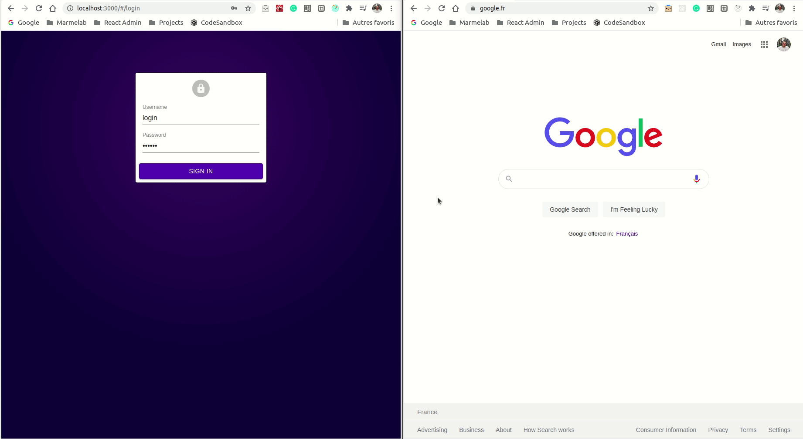

# ra-data-google-sheets: a data provider for react-admin, based on Google Sheets

<table>
    <tr>
        <td></td>
        <td>
            <strong>Archived Repository</strong><br />
            The code of this repository was written during a <strong>Hack Day</strong> by a <a href="https://marmelab.com/en/jobs">marmelab developer</a>. It's part of the distributed R&D effort at marmelab, where each developer spends 2 days a month for learning and experimentation.<br />
            <strong>This code is not intended to be used in production, and is not maintained.</strong>
        </td>
    </tr>
</table>

Create a Google Sheet spreadsheet, add your data and build an entire admin app on it.

This module provides a [react-admin data provider](https://marmelab.com/react-admin/DataProviders.html#data-providers) and Google API helpers to work with private documents.

More details are coming on [marmelab's blog](https://marmelab.com).



## Development

**Requirements:**

- Dependencies are managed by [yarn](https://yarnpkg.com/)
- Commands are launched using `make`

**Setup:**

Install the dependencies with:

```sh
make install
```

**Start:**

Start the demo application in watch mode with:

```sh
make start
```

## Data

You can find data in the `./assets/` folder to help you reproducing the demo.

These data are formatted using **CSV files separated by comma**.

1. Devs:
   1. Create a first tab named `devs`
   2. Import the content of the file `/assets/ra-data-google-sheets-devs.csv`

2. Devs:
   1. Create a second tab named `projects`
   2. Import the content of the file `/assets/ra-data-google-sheets-projects.csv`

## Distribution

**Build:**

Build the library using:

```sh
make build
```
